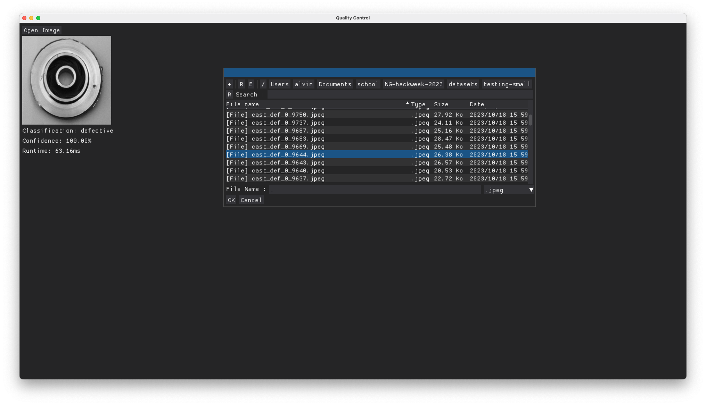
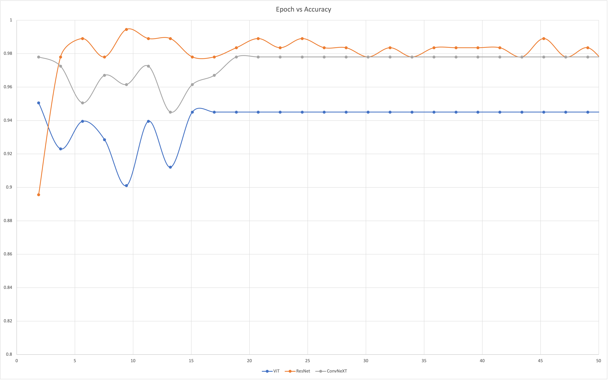
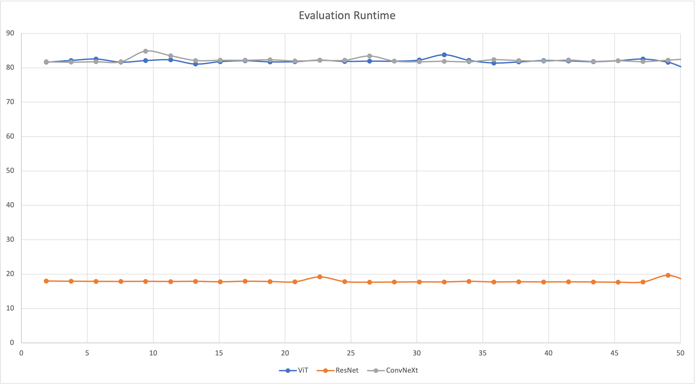

# Quality Control Challenge Project

This was a group project for the Fall 2023 Northrop Grumman Innovation Hack Week. The challenge was to (re)train an image recognition model to recognize defective parts from manufacturing. Several pre-trained models and dataset ratios were trained and analyzed before selecting the final model. A companion app was created to test the model.

A screenshot of the companion app:

A graph of the accuracy vs the number of passes through the dataset for the different models.

A graph of the runtime (in seconds) to analyze 120 images for the different models.

